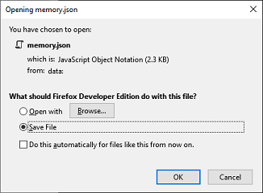

# Memory


Memory is a web/mobile application (website, if you may) that takes a CSV/JSON of your old text messages and present it in a more convenient presentation. It also doubles as a messaging interface which you can freely use for more live applications (such as a messaging application!)

## Features
* Accepts CSV exports of your text messages. Just follow the format or use [SMS Backup & Restore](https://play.google.com/store/apps/details?id=com.riteshsahu.SMSBackupRestore) on your mobile phone which is the basis of the CSV columns required to read and present your messages.
* Mock send/receive messages from and to your contact. Allows you to create new contacts too!
* Save loaded contacts and messages into a JSON file that can be re-used in the future. SWEET!
* Toggle night/dark mode if you have sadistic tendencies for eye strain.
* MOBILE RESPONSIVE AW YISS 

## Development notes:
* Developed using ASP(dot)NET Core's [React Project Template](https://docs.microsoft.com/en-us/aspnet/core/client-side/spa/react?view=aspnetcore-3.1) with some modernization here and there because the template is a little too old.
* Still not quite ESNext as React Project Template is a "little too old"
* A sample CSV/JSON is provided under ```examples/```

### If you want to utilize CSVs as the Data Source:

You will need to run the solution using Visual Studio as the backend is running on ASP (dot) NET. Then just simply run the application and you're free to utilize all features.

### If you don't need CSV capabilities:

Visual Studio is not necessary as this application can stand on its own. Simply head to the ClientApp folder and run the necessary commands to run a React application.

## CSV Columns

The CSV Columns required on this application is derived from the exported columns on the Android Application [SMS Backup & Restore](https://play.google.com/store/apps/details?id=com.riteshsahu.SMSBackupRestore). You are free to use any other application as long as the CSV columns and the data match. The order of the columns is not mandatory to be followed and is more for human readability only. For your CSV to be read by the backend, you need the following columns:

* Date
* Time
* Type
* Number
* Name
* Message

### Date, Time

All date/times values are to be formatted in ISO 8601 definitions. For some reason, SMS Backup & Restore split the two. Examples of these values are:

Date: 2011-09-11, 2012-12-21
Time: 03:00:00, 16:20:00

### Type

Type is still a remnant of SMS Backup & Restore. It's only values are: **in** and **out**

### Number, Name, Message

These columns are self-explanatory and can be a mixture of string and int.

## Getting started

1. [First run](#first-run)
2. [Conversation Window](#conversation-window)
3. [Conversation Menu](#conversation-menu)
4. [Contacts Menu](#contacts-menu)

### First Run

After running the application, you will be greeted with a prompt to upload a data source.


You may skip this, but you will start with empty conversations. Simply provide the necessary file using the correct contents and click **Save Changes**. You may change your data source anytime under *Menu -> Load Data Source*

Once your data source has been successfully processed, you should now be able to navigate through your contacts and messages.


Selecting a contact will open your conversation history with them (if there are any to begin with.)


### Conversation Window

You may mock send/receive messages by typing in values in the textarea below and hitting **Send**


To mock receive a message, type in something in the textarea and click the arrow right beside **Send**, then **Send as Contact** to change the behaviour of send button. The button should change color indicating how the message should be sent.


### Conversation Menu

You are able to delete a contact and its conversations by hitting **Delete** on the top right. You can also edit a contact's name and number by clicking **Edit**. **Close** will remove the conversation in the active window.

If your application's layout has changed to the mobile mode where such buttons are not visible, clicking the menu on the top-right will show you options on the active conversation. Clicking **Close** will bring you back to the Contacts menu


### Contacts Menu

Going back to the Contacts section, under the Menu on the top-right, you can create new contacts by clicking **New Contact**


You can also toggle the night light mode from there!


Or load a new data source under **Load Data Source**. If you want to save the current state of your contacts and messages to be reused later, simply hit **Save Current Data Source**.



### License

This software is licensed under MIT License, as a way of giving back of me leeching to the community and inadvertently crashing licensing requirements for the past 10 years in my professional career.